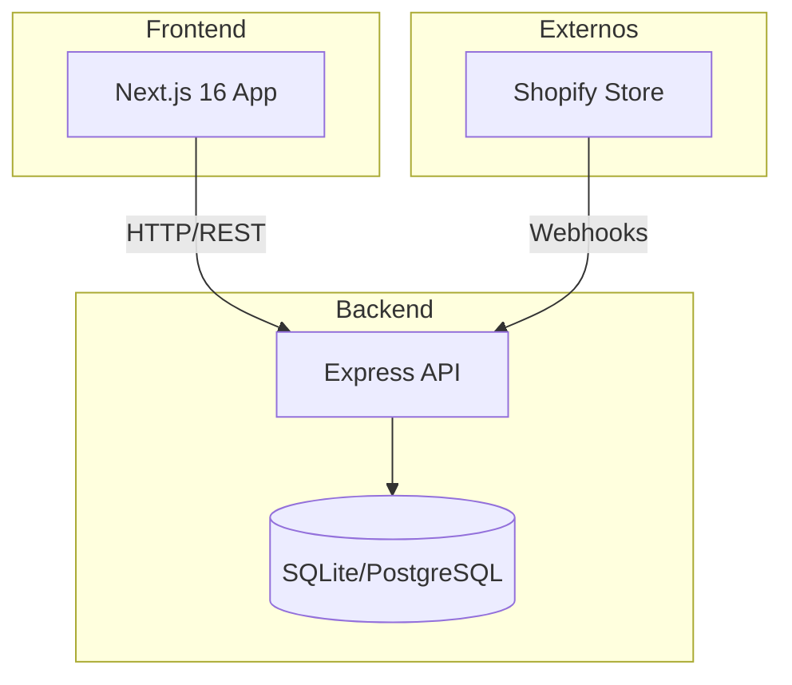

# La Casita - Sistema de Gestión Integral

Sistema centralizado para la gestión de inventario, ventas y sincronización con Shopify para "La Casita". Diseñado para unificar el control de almacén, puntos de venta (Casita 1, Casita 2, Restaurante) y la tienda online.


---

## 📖 Tabla de Contenidos
- [Arquitectura](#-arquitectura)
- [Stack Tecnológico](#-stack-tecnológico)
- [Estructura del Proyecto](#-estructura-del-proyecto)
- [Instalación y Uso](#-instalación-y-uso)
- [Variables de Entorno](#-variables-de-entorno)
- [Roadmap](#-roadmap)

---

## 🏗 Arquitectura

El sistema sigue una arquitectura de monorepo con frontend y backend separados:



---

## 🛠 Stack Tecnológico

| Componente | Tecnología | Descripción |
|------------|------------|-------------|
| **Frontend** | Next.js 16 + Tailwind CSS | Panel de administración y POS |
| **Backend** | Express + TypeScript | API REST centralizada |
| **Base de Datos** | SQLite / PostgreSQL | Almacenamiento relacional |
| **ORM** | Prisma | Manejo de base de datos |
| **UI** | shadcn/ui | Componentes de interfaz |
| **Estado** | Zustand | Estado del cliente |

---

## 📂 Estructura del Proyecto

```text
lacasita/
├── apps/                       # Aplicaciones principales
│   ├── api/                    # Backend (Node.js + Express)
│   │   ├── src/
│   │   │   ├── modules/        # Módulos de negocio
│   │   │   │   ├── products/   # Gestión de productos
│   │   │   │   ├── sales/      # Ventas
│   │   │   │   ├── inventory/  # Inventario
│   │   │   │   ├── cash-session/ # Sesiones de caja
│   │   │   │   ├── locations/  # Ubicaciones
│   │   │   │   ├── categories/ # Categorías
│   │   │   │   └── reports/    # Reportes
│   │   │   ├── db/             # Conexión DB
│   │   │   └── index.ts        # Punto de entrada
│   │   ├── prisma/             # Schema y seed
│   │   └── package.json
│   │
│   └── web/                    # Frontend (Next.js)
│       ├── src/
│       │   ├── app/            # App Router
│       │   ├── components/     # Componentes UI
│       │   ├── store/          # Estado (Zustand)
│       │   └── lib/            # Utilidades
│       └── package.json
│
├── infra/                      # Infraestructura
│   ├── docker-compose.yml      # Orquestación
│   ├── nginx.conf              # Proxy inverso
│   └── n8n/                    # Workflows de automatización
│
├── docs/                       # Documentación
│   └── schema.md               # Diagramas de BD
│
├── .env.example                # Variables de entorno
└── package.json                # Workspaces
```

---

## 🚀 Instalación y Uso

### Requisitos Previos
- [Bun](https://bun.sh/) v1.3+
- [Node.js](https://nodejs.org/) v18+ (opcional)

### Pasos para desarrollo local

1. **Clonar el repositorio**
   ```bash
   git clone https://github.com/tu-usuario/lacasita.git
   cd lacasita
   ```

2. **Instalar dependencias**
   ```bash
   bun install
   ```

3. **Configurar variables de entorno**
   ```bash
   cp .env.example .env
   ```

4. **Inicializar base de datos**
   ```bash
   bun run db:push
   bun run db:seed
   ```

5. **Iniciar en desarrollo**
   ```bash
   bun run dev
   ```
   
   Esto inicia:
   - **API**: http://localhost:3001
   - **Web**: http://localhost:3000

### Comandos disponibles

| Comando | Descripción |
|---------|-------------|
| `bun run dev` | Inicia API y Web en desarrollo |
| `bun run dev:api` | Solo la API |
| `bun run dev:web` | Solo el frontend |
| `bun run build` | Compilar para producción |
| `bun run db:push` | Sincronizar schema con BD |
| `bun run db:seed` | Poblar con datos de ejemplo |
| `bun run lint` | Verificar código |

---

## 🔐 Variables de Entorno

| Variable | Descripción | Ejemplo |
|----------|-------------|---------|
| `DATABASE_URL` | Cadena de conexión | `file:./db/lacasita.db` |
| `API_PORT` | Puerto de la API | `3001` |
| `NEXT_PUBLIC_API_URL` | URL de la API (frontend) | `http://localhost:3001` |
| `SHOPIFY_API_KEY` | API Key de Shopify | `shpat_...` |
| `SHOPIFY_WEBHOOK_SECRET` | Secreto webhooks | `whsec_...` |

---

## 🗺 Roadmap

- [x] **Fase 0:** Inicialización del repositorio
- [x] **Fase 1:** Sistema POS básico (productos, ventas, inventario)
- [ ] **Fase 2:** Integración con Shopify
- [ ] **Fase 3:** Control de restaurante
- [ ] **Fase 4:** Reportes avanzados
- [ ] **Fase 5:** Automatizaciones con n8n

---

## 📄 Licencia

Este proyecto es privado y propiedad de La Casita. Uso interno únicamente.
