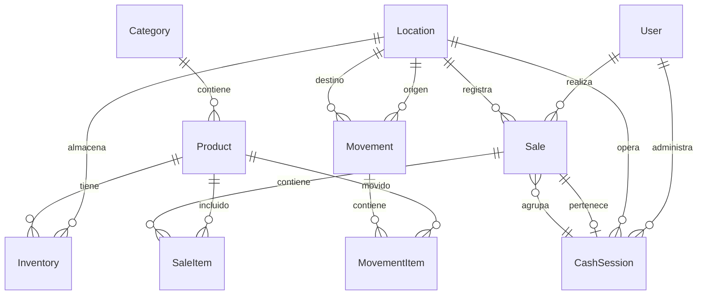

# La Casita - Documentación de Base de Datos

## Diagrama ER

## Modelos

### User (Usuario)
Usuarios del sistema (administradores, cajeros, supervisores).

| Campo | Tipo | Descripción |
|-------|------|-------------|
| id | String | Identificador único (CUID) |
| email | String | Correo electrónico (único) |
| name | String | Nombre completo |
| password | String | Contraseña hasheada |
| role | String | Rol: admin, cajero, supervisor |
| active | Boolean | Usuario activo/inactivo |
| createdAt | DateTime | Fecha de creación |
| updatedAt | DateTime | Última actualización |

### Location (Ubicación)
Sucursales y almacenes del negocio.

| Campo | Tipo | Descripción |
|-------|------|-------------|
| id | String | Identificador único |
| name | String | Nombre (Almacén Central, Casita Market, etc.) |
| type | String | Tipo: almacen, tienda, restaurante |
| address | String? | Dirección física |
| active | Boolean | Ubicación activa |

### Category (Categoría)
Categorías de productos.

| Campo | Tipo | Descripción |
|-------|------|-------------|
| id | String | Identificador único |
| name | String | Nombre de la categoría |
| description | String? | Descripción |
| color | String | Color para UI (#hex) |
| icon | String? | Nombre del icono |
| active | Boolean | Categoría activa |

### Product (Producto)
Catálogo de productos.

| Campo | Tipo | Descripción |
|-------|------|-------------|
| id | String | Identificador único |
| barcode | String? | Código de barras (único) |
| sku | String? | SKU del producto (único) |
| name | String | Nombre del producto |
| description | String? | Descripción |
| categoryId | String? | FK a Category |
| costPrice | Float | Precio de costo |
| salePrice | Float | Precio de venta |
| unit | String | Unidad: pieza, kg, litro, paquete |
| imageUrl | String? | URL de imagen |
| active | Boolean | Producto activo |

### Inventory (Inventario)
Stock de productos por ubicación.

| Campo | Tipo | Descripción |
|-------|------|-------------|
| id | String | Identificador único |
| productId | String | FK a Product |
| locationId | String | FK a Location |
| quantity | Int | Cantidad en stock |
| minStock | Int | Stock mínimo (alerta) |
| maxStock | Int | Stock máximo |
| expiryDate | DateTime? | Fecha de caducidad |
| batchNumber | String? | Número de lote |

**Índice único**: (productId, locationId)

### Sale (Venta)
Registro de ventas.

| Campo | Tipo | Descripción |
|-------|------|-------------|
| id | String | Identificador único |
| invoiceNumber | String | Número de factura (F0001, etc.) |
| locationId | String | FK a Location |
| cashierId | String | FK a User |
| sessionId | String? | FK a CashSession |
| subtotal | Float | Subtotal sin descuento |
| tax | Float | Impuestos |
| discount | Float | Descuento aplicado |
| total | Float | Total final |
| paymentMethod | String | Método: efectivo, tarjeta, transferencia |
| cashReceived | Float? | Efectivo recibido |
| change | Float? | Cambio entregado |
| status | String | Estado: pendiente, completada, cancelada |
| notes | String? | Notas |

### SaleItem (Item de Venta)
Productos incluidos en una venta.

| Campo | Tipo | Descripción |
|-------|------|-------------|
| id | String | Identificador único |
| saleId | String | FK a Sale |
| productId | String | FK a Product |
| quantity | Int | Cantidad vendida |
| unitPrice | Float | Precio al momento de venta |
| costPrice | Float | Costo al momento de venta |
| discount | Float | Descuento en el item |
| subtotal | Float | Subtotal del item |

### CashSession (Sesión de Caja)
Control de turnos de caja.

| Campo | Tipo | Descripción |
|-------|------|-------------|
| id | String | Identificador único |
| locationId | String | FK a Location |
| cashierId | String | FK a User |
| openingCash | Float | Efectivo inicial |
| openedAt | DateTime | Fecha/hora de apertura |
| closingCash | Float? | Efectivo al cerrar |
| expectedCash | Float? | Efectivo esperado |
| difference | Float? | Diferencia (sobrante/faltante) |
| closedAt | DateTime? | Fecha/hora de cierre |
| totalSales | Float | Total de ventas |
| totalCash | Float | Ventas en efectivo |
| totalCard | Float | Ventas con tarjeta |
| totalTransfer | Float | Ventas por transferencia |
| totalItems | Int | Total de items vendidos |
| status | String | Estado: abierta, cerrada |

### Movement (Movimiento)
Movimientos de inventario.

| Campo | Tipo | Descripción |
|-------|------|-------------|
| id | String | Identificador único |
| type | String | Tipo: entrada, salida, transferencia, ajuste |
| fromLocationId | String? | FK a Location (origen) |
| toLocationId | String? | FK a Location (destino) |
| reason | String? | Motivo del movimiento |
| notes | String? | Notas |
| userId | String | FK a User (autoriza) |
| status | String | Estado: pendiente, completado, cancelado |

### MovementItem (Item de Movimiento)
Productos en un movimiento.

| Campo | Tipo | Descripción |
|-------|------|-------------|
| id | String | Identificador único |
| movementId | String | FK a Movement |
| productId | String | FK a Product |
| quantity | Int | Cantidad movida |
| notes | String? | Notas |
