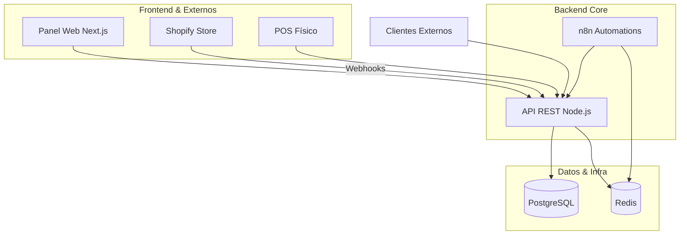

# La Casita - Sistema de Gestión Integral

Sistema centralizado para la gestión de inventario, ventas y sincronización con Shopify para "La Casita". Diseñado para unificar el control de almacén, puntos de venta (Casita 1, Casita 2, Restaurante) y la tienda online.


---

## 📖 Tabla de Contenidos
- [Arquitectura](#-arquitectura)
- [Stack Tecnológico](#-stack-tecnológico)
- [Estructura del Proyecto](#-estructura-del-proyecto)
- [Instalación y Uso](#-instalación-y-uso)
- [Variables de Entorno](#-variables-de-entorno)
- [Roadmap](#-roadmap)

---

## 🏗 Arquitectura

El sistema sigue una arquitectura de microservicios ligera orquestada mediante Docker. La API central actúa como el cerebro que conecta la base de datos, el frontend y los servicios externos.



---

## 🛠 Stack Tecnológico

| Componente | Tecnología | Descripción |
|------------|------------|-------------|
| **Backend** | Node.js + Express | API REST centralizada. |
| **Frontend** | Next.js 14 + Tailwind CSS | Panel de administración interno. |
| **Base de Datos** | PostgreSQL 15 | Almacenamiento relacional de productos, ventas y usuarios. |
| **Cache** | Redis | Manejo de sesiones y caché de consultas frecuentes. |
| **Automatización** | n8n | Workflows visuales para alertas y sincronización. |
| **Infraestructura** | Docker + Docker Compose | Contenedorización de servicios. |

---

## 📂 Estructura del Proyecto

Este repositorio utiliza una arquitectura **Monorepo** para mantener todo el código centralizado pero modular.

```text
lacasita/
├── apps/                       # Aplicaciones principales
│   ├── api/                    # Backend (Node.js + Express)
│   │   ├── src/
│   │   │   ├── modules/        # Módulos de negocio (Inventario, Ventas, etc.)
│   │   │   ├── db/             # Conexión y configuración DB
│   │   │   └── index.js        # Punto de entrada
│   │   └── package.json
│   │
│   └── web/                    # Frontend (Next.js)
│       ├── app/                # App Router (Dashboard, Inventario)
│       ├── components/         # Componentes UI (shadcn/ui)
│       └── package.json
│
├── infra/                      # Configuración de infraestructura
│   ├── docker-compose.yml      # Orquestación de servicios
│   ├── nginx.conf              # Configuración del proxy inverso
│   └── n8n/                    # Workflows exportados de n8n
│
├── docs/                       # Documentación adicional
│   └── schema.md               # Diagramas de base de datos
│
├── .env.example                # Variables de entorno de ejemplo
├── .gitignore
└── package.json                # Configuración de Workspaces (Raíz)
```

---

## 🚀 Instalación y Uso

### Requisitos Previos
- [Docker Desktop](https://www.docker.com/products/docker-desktop/) instalado.
- Node.js v18+ (si vas a desarrollar fuera de Docker).
- Git.

### Pasos para levantar el proyecto

1. **Clonar el repositorio**
   ```bash
   git clone https://github.com/tu-usuario/lacasita.git
   cd lacasita
   ```

2. **Configurar variables de entorno**
   Crea una copia del archivo de ejemplo y configúralo:
   ```bash
   cp .env.example .env
   ```

3. **Levantar los servicios (Base de datos, Redis, n8n)**
   ```bash
   cd infra
   docker-compose up -d db redis n8n
   ```

4. **Instalar dependencias (Modo Desarrollo Local)**
   Vuelve a la raíz e instala los paquetes de Node:
   ```bash
   cd ..
   npm install
   ```

5. **Iniciar la aplicación**
   ```bash
   npm run dev
   ```
   - **Frontend:** http://localhost:3000
   - **API:** http://localhost:3001
   - **n8n:** http://localhost:5678 (Usuario: admin / Pass: password123)

---

## 🔐 Variables de Entorno

Asegúrate de configurar estas variables en tu archivo `.env` antes de desplegar:

| Variable | Descripción | Ejemplo |
|----------|-------------|---------|
| `DATABASE_URL` | Cadena de conexión a Postgres | `postgresql://user:pass@db:5432/lacasita` |
| `REDIS_URL` | URL de conexión a Redis | `redis://redis:6379` |
| `SHOPIFY_API_KEY` | API Key de tu tienda Shopify | `shpat_...` |
| `SHOPIFY_WEBHOOK_SECRET` | Secreto para validar webhooks | `whsec_...` |

---

## 🗺 Roadmap

Fases planificadas para el desarrollo del sistema:

- [x] **Fase 0:** Inicialización del repositorio y Docker Compose base.
- [ ] **Fase 1:** Modelo de datos (Productos, Inventario, Ubicaciones).
- [ ] **Fase 2:** API CRUD de Inventario y autenticación básica.
- [ ] **Fase 3:** Sincronización inicial con Shopify (Webhooks de pedidos).
- [ ] **Fase 4:** Panel Web (Dashboard y visualización de stock).
- [ ] **Fase 5:** Automatizaciones de alertas con n8n (Stock bajo).

---

## 📄 Licencia

Este proyecto es privado y propiedad de La Casita. Uso interno únicamente.
```
